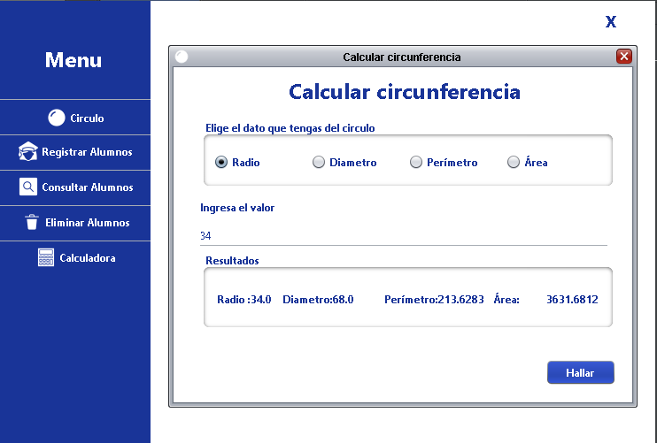

# Ejemplo-basico-java-swing

Ejemplo basico de java swing  en cual se realiza una conexion con una base de datos mysql.

1. Se realiza un login basico:

2. Un crud de alumnos

3. una sencilla calculadora

 y una calculadora de  circunferencia

# Para ejecutar

1. Agregar el conector de Java a MySQL. (mysql-connector-java-5.0.8-bin).

2. Cargar la Base de Datos a MySQL. (ejemplo-basico-java-swing.sql).

3. Editar las constantes de conexión en la Clase Conexion.java ubicada src\autentificación\conexion cons us credenciales de mysql

